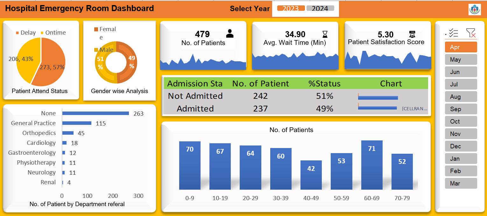
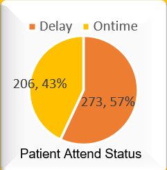
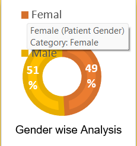
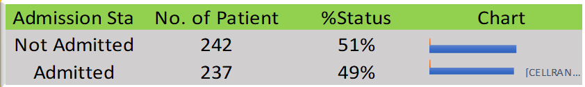
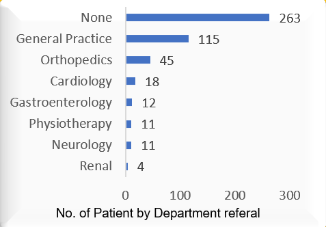
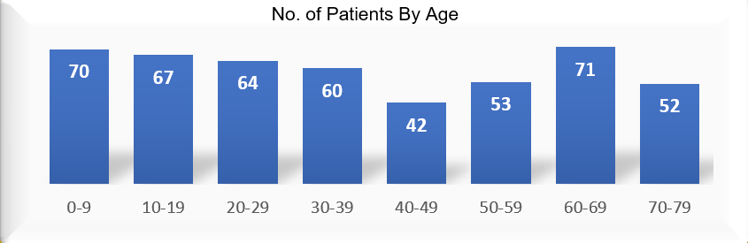

# Hospital Emergency Room Analytics Dashboard

## 🏥 Project Overview
This project provides a comprehensive, interactive Excel dashboard designed to track and analyze Emergency Room (ER) operations. By transforming raw patient admission logs into actionable visual insights, this tool helps hospital administrators monitor patient flow, manage wait times, understand demographic distributions, and improve overall patient satisfaction.

## 📊 Master Dashboard

*(Note: Ensure `dashboard_image.png` is uploaded to your GitHub repository in the same directory as this README.)*

---

## 🔑 Key Performance Indicators (KPIs)
Based on the dashboard's primary snapshot (Filtered for Years 2023-2024):
*   **Total Number of Patients:** 479
*   **Average Wait Time:** 34.90 Minutes
*   **Average Patient Satisfaction Score:** 5.30 / 10

---

## 📈 Detailed Chart Analysis & Insights

### 1. Patient Attend Status (SLA Compliance)

*   **Visual:** Pie Chart
*   **Data:** 57% Delay (273 patients) | 43% Ontime (206 patients)
*   **Insight:** The hospital is currently missing its 30-minute target wait time for the majority of its patients. This indicates a significant operational bottleneck in triage or physician availability.

### 2. Gender-wise Analysis

*   **Visual:** Doughnut Chart
*   **Data:** 51% Male | 49% Female
*   **Insight:** ER visits are perfectly balanced across genders, meaning resource allocation does not need to be heavily skewed toward gender-specific acute care at the entry level.

### 3. Admission Status

*   **Visual:** Horizontal Bar / Table
*   **Data:** 51% Not Admitted (242 patients) | 49% Admitted (237 patients)
*   **Insight:** Almost half of the ER visits result in hospital admission. This high conversion rate suggests that patients arriving at the ER are experiencing severe, acute issues requiring prolonged inpatient care.

### 4. Patient Volume by Department Referral

*   **Visual:** Horizontal Bar Chart
*   **Data Highlights:** 
    *   None (Walk-ins): 263
    *   General Practice: 115
    *   Orthopedics: 45
*   **Insight:** The massive volume of "None" (walk-in) referrals shows the ER is heavily used as primary care by the local community. Partnering with urgent care centers could redirect non-critical walk-ins and reduce overall wait times.

### 5. Patient Age Distribution

*   **Visual:** Vertical Column Chart
*   **Data Highlights:** Peaks at 0-9 years (70 patients) and 60-69 years (71 patients).
*   **Insight:** The data displays a classic bimodal distribution. The ER is predominantly handling pediatric emergencies and geriatric complications, suggesting staffing should prioritize pediatricians and geriatric specialists.

---

## 🧮 Formulas and Business Logic

The dashboard is powered by the following core concepts and formulas:

**1. Wait Time SLA (Ontime vs. Delay)**
A conditional formula is used to classify whether a patient was attended to within the hospital's strict 30-minute Service Level Agreement (SLA).
```excel
=IF([Patient Waittime] <= 30, "Ontime", "Delay")
